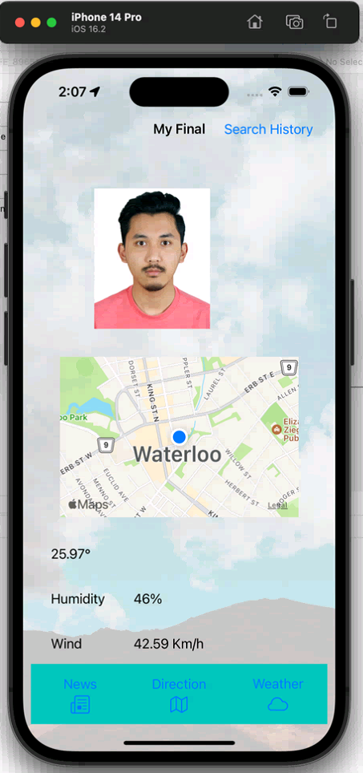
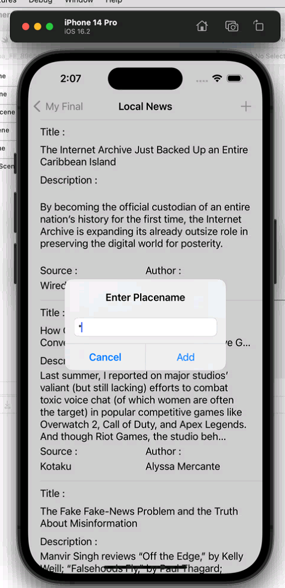
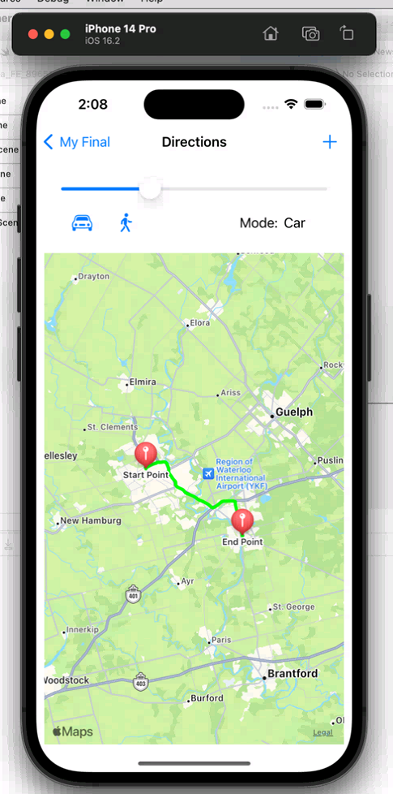
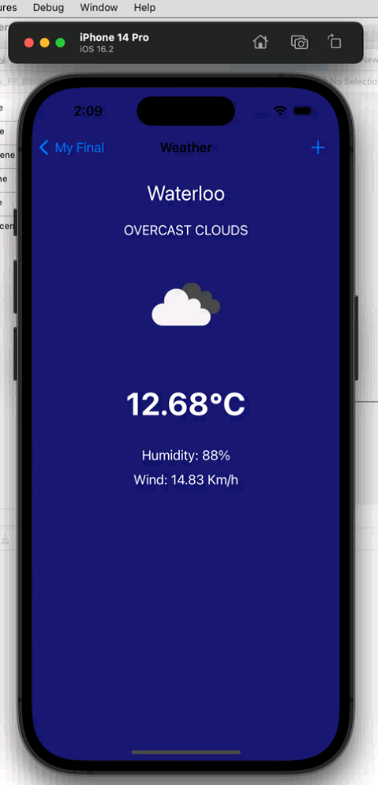
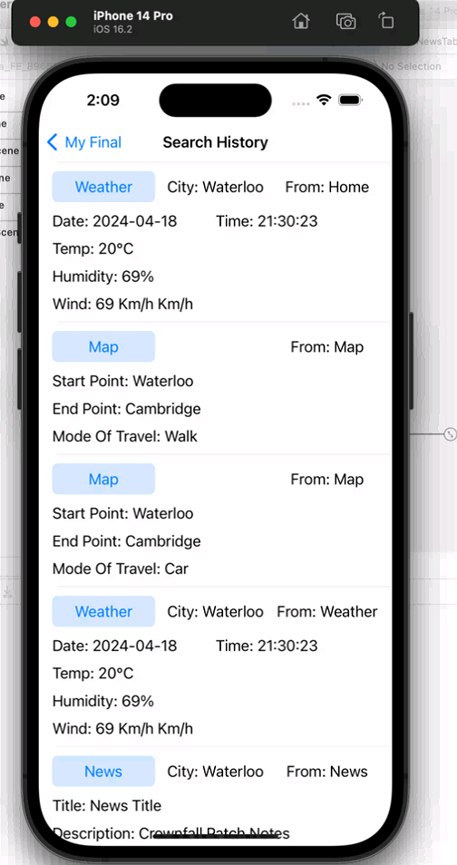

# Todo App

This is a simple Todo app built with Swift.

## Features

- Has 5 pages (Main Page (Image, Current Location and its Weather), Local News, Map Direction, Weather, History)
- Main Page show current location and fetches weather information based on longitude and latitude from https://openweathermap.org/api.
- Local News page fetches news from https://newsapi.org/ based on keyword which is inputed using the PLUS (+) button.
- Map Direction which takes a start and end location and provides the direction between those points. Two mode of transport (Automobile and Walking) can be selected.
- Zoom in and out map using slider.
- Weather page which show the weather based on the city name input.
- History page which stores all the activity of user from above page in database using Core Data. Programmatic navigation to other pages from history page.
- Delete log from history page
- Seed 5 history logs to Core Data if database is empty.

## Screenshots

